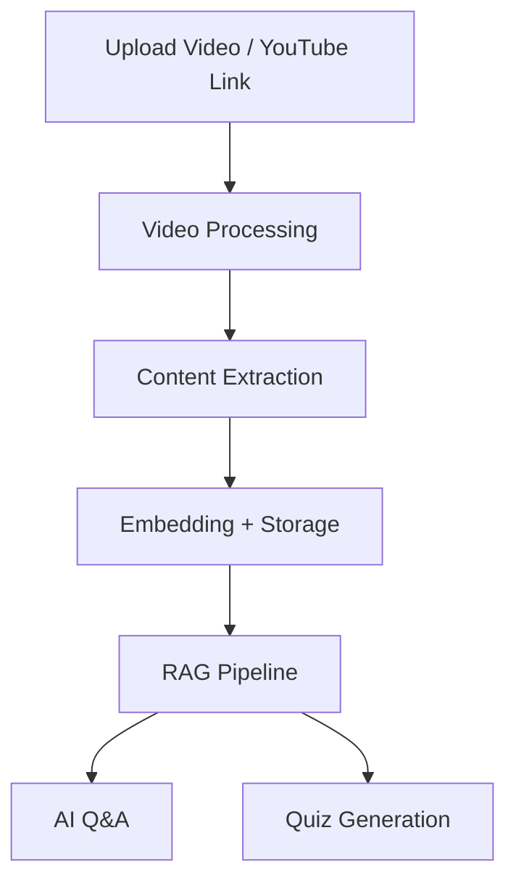

# 🎥 AI Video Tutor

### Learn From Videos — Actively, Not Passively

<p align="center">
  <b>Upload a video → Ask questions → Generate quizzes → Actually understand it</b>
</p>

---

## 🚀 Overview

AI Video Tutor is a **full-stack AI learning platform** that transforms any video into an **interactive study experience**.

Instead of just watching content, users can:

* 💬 Ask questions
* 🧠 Test understanding
* 📚 Extract structured knowledge

Built with a **multi-model AI pipeline**, this project demonstrates real-world usage of **RAG (Retrieval-Augmented Generation)** in an educational context.

---

## ✨ Key Features

* 🎬 **Video Upload + YouTube Support**
  Seamlessly ingest local files or online videos

* 🤖 **AI Tutor (RAG-based Q&A)**
  Ask anything — answers are grounded in actual video content

* 🧠 **Auto Quiz Generation**
  Reinforce learning with AI-generated quizzes

* 📺 **Interactive Learning UI**
  Watch and chat with AI simultaneously

* 🔐 **Authentication System**
  Secure login and user-specific data

* ☁️ **Cloud Storage (Supabase)**
  Scalable storage for videos and metadata

---

## 🧠 How It Works



---

## 🏗️ Architecture

### 🔧 Backend (Flask)

The backend is organized with a **clear entry point and modular support files**:

* **`app.py` (Core Backend)**
  This is the **main and central file** of the backend. It handles:

  * All routes and API endpoints
  * Authentication and session management
  * Integration with AI services

* **Supporting Modules**
  These files assist `app.py` and keep the code clean and scalable:

  * **`models.py`** → Database schema and models
  * **`processing.py`** → Video processing pipeline
  * **`rag.py`** → Retrieval-Augmented Generation logic
  * **`utils.py`** → Helper and utility functions

👉 In short: `app.py` runs the backend, and the rest support it.

### 🎨 Frontend

* HTML + Tailwind CSS + Vanilla JS
* Jinja2 templating via Flask

### 🤖 AI Layer

* Gemini API for:

  * Understanding video content
  * Answering questions
  * Generating quizzes

### 🗄️ Data Layer

* PostgreSQL (Supabase)
* Supabase Storage (videos)

---

## 📂 Project Structure

```
AI Video Tutor/
│
├── frontend/
│   ├── templates/        # Jinja2 HTML templates
│   └── static/           # CSS, JS, assets
│
├── backend/
│   ├── app.py            # Main backend (entry point)
│   ├── models.py         # Database models
│   ├── processing.py     # Video processing pipeline
│   ├── rag.py            # AI + RAG logic
│   └── utils.py          # Helper functions
│
├── docker-compose.yml
├── Dockerfile
├── deploy.sh
│
├── ARCHITECTURE.md
├── FUTURE_SCOPE.md
└── .env
```

AI Video Tutor/
│
├── frontend/
│   ├── templates/
│   └── static/
│
├── app.py                # Main backend (entry point)
├── models.py             # Database models
├── processing.py         # Video processing
├── rag.py                # AI + RAG logic
├── utils.py              # Helper functions
│
├── docker-compose.yml
├── Dockerfile
├── deploy.sh
│
├── ARCHITECTURE.md
├── FUTURE_SCOPE.md
└── .env

````

---

## ⚙️ Setup

### 1️⃣ Clone

```bash
git clone https://github.com/your-username/ai-video-tutor.git
cd ai-video-tutor
````

### 2️⃣ Environment Variables

```env
SECRET_KEY=your_secret_key
DATABASE_URL=your_database_url
SUPABASE_URL=your_supabase_url
SUPABASE_KEY=your_supabase_key
GEMINI_API_KEY=your_gemini_api_key
```

---

### 🐳 Run with Docker

```bash
docker-compose up --build
```

---

### 💻 Run Locally

```bash
pip install -r requirements.txt
python app.py
```

---

## 🔌 API Endpoints

| Endpoint           | Method | Description                 |
| ------------------ | ------ | --------------------------- |
| `/upload`          | POST   | Upload video / YouTube link |
| `/video/<id>/qa`   | POST   | Ask questions               |
| `/video/<id>/quiz` | GET    | Get quiz                    |

---

## 🛠️ Tech Stack

* **Backend:** Flask (Python)
* **Frontend:** HTML, Tailwind, JS
* **Database:** PostgreSQL (Supabase)
* **Storage:** Supabase Storage
* **AI:** Gemini API
* **Video Processing:** yt-dlp

---

## 📈 Future Roadmap

* 🌍 Multi-language support
* ⚡ Async processing (queues/workers)
* 📊 Learning analytics dashboard
* 👥 Collaborative learning
* 📱 Mobile-first UI

---

## 🤝 Contributing

```bash
# Fork → Clone → Create branch
git checkout -b feature/your-feature

# Commit & push
git commit -m "Add feature"
git push origin feature/your-feature
```

Then open a Pull Request 🚀

---

## 📄 License

MIT License

---

## ⭐ Support

If you like this project:

👉 Star the repo
👉 Share it
👉 Build on top of it

---

## 💡 Author Note

This project is built to demonstrate:

* Real-world AI integration (RAG)
* Full-stack system design
* Scalable architecture patterns

---

<p align="center">
  🚀 <b>From passive watching → to active learning</b>
</p>
